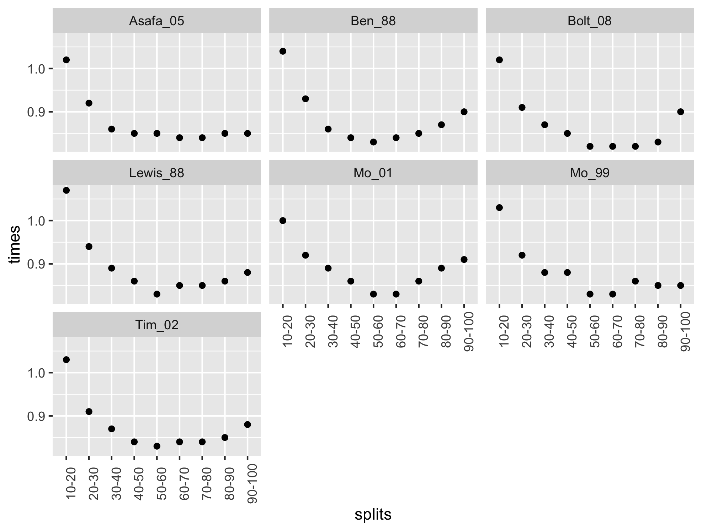
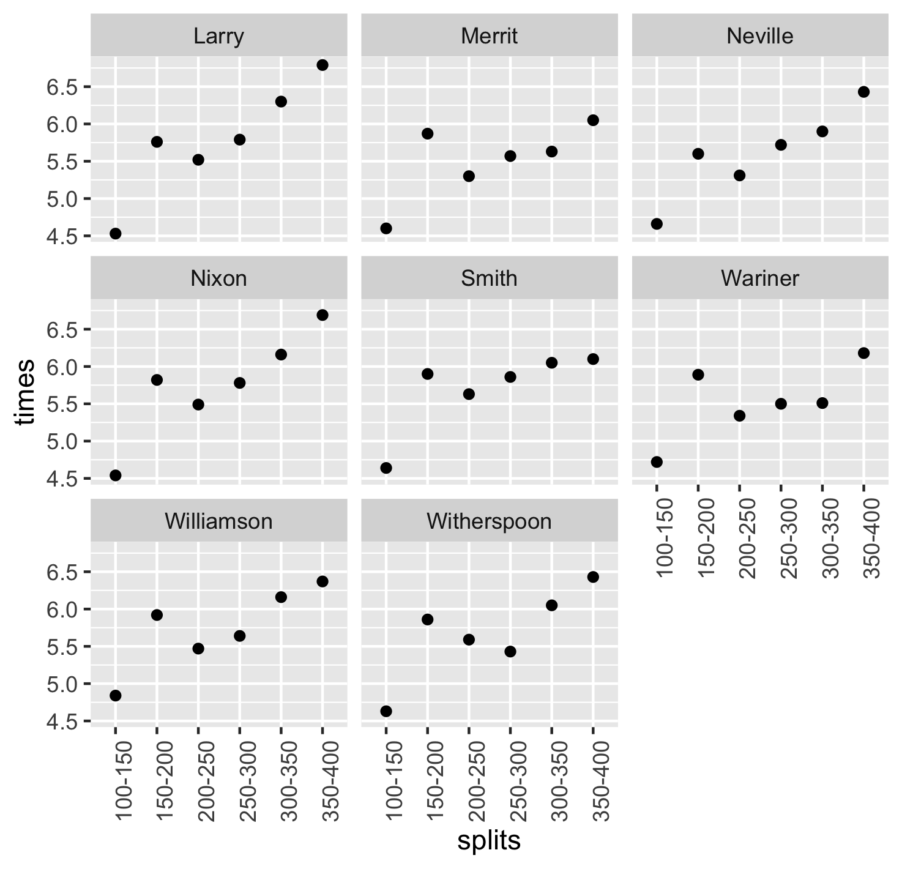

```{r setup, include=FALSE}
knitr::opts_chunk$set(echo = TRUE)
```

### Introduction and Background

I became interested in the human body's ability to sprint/run over certain distances after learning that in the 100m sprint, the shortest event in track and field, the sprinters are already slowing down towards the end. This was intriguing to me, and I wanted to learn more. 

To begin this project, I took data from https://speedendurance.com/ which has data from many events in track and field, including the splits for each runner in different events. In track and field, a "split" is a term used to define a runners pace over different lengths of the race; how fast they complete a certain section of the race. 

#### 100 meter dash

Plotted below are some of the fastest 100 meter dashes in Olympic history, with a wide range of years, from Carl Lewis in 1988 to Usain Bolt in 2008. The 0-10m split is not shown, as that is largely a factor of the runner's reaction time.

```{r, echo = FALSE, out.width = "400px"}

```

We can see from the plot above that runners indeed slow down nearing the end of the race, and in some cases, like Bolt and Mo, they slow down *quite a lot*. 

#### 400 meter dash

Let's look at splits from the 400 meter dash. This is a much longer event in track and field, so let's see if we can observe anything that stands out

Plotted below are the 50m splits from the 2008 Olympic Trials Men's 400m Finals

```{r, echo = FALSE, out.width = "400px"}

```

This is very telling, we see that the runners start out very fast, then slow down, speed up again, then gradually slow down. Let's make a model to document this bizarre occurance.